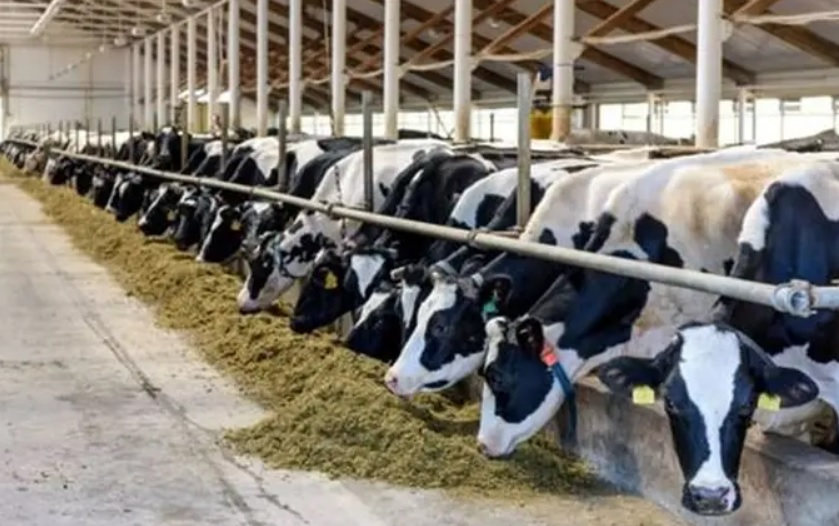

  

# Market Analysis

## Overview

The dairy and biogas sector represents a strong and growing market driven by increasing demand for food, energy, and sustainable agricultural solutions.

This project operates at the intersection of three high-demand markets:

- Dairy products  
- Renewable energy  
- Organic fertilizers  

---

## Dairy Market

### Demand Drivers

- Population growth  
- Increasing demand for protein-rich food  
- Expansion of food processing industries  

### Market Opportunity

- Stable and continuous demand  
- High consumption across both domestic and regional markets  
- Potential for industrial dairy supply contracts  

---

## Renewable Energy Market

### Demand Drivers

- Global shift toward clean energy  
- Increasing energy demand  
- Government incentives for renewable energy  

### Market Opportunity

- Biogas as a stable and dispatchable energy source  
- Reduced dependency on fossil fuels  
- Potential grid integration or on-site energy use  

---

## Fertilizer Market

### Demand Drivers

- Agricultural expansion  
- Soil degradation and nutrient demand  
- Shift toward organic and sustainable farming  

### Market Opportunity

- High demand for organic fertilizers  
- Reduced reliance on chemical fertilizers  
- Strong positioning in sustainable agriculture markets  

---

## Competitive Advantage

This project benefits from:

- Integrated production model  
- Multiple revenue streams  
- Lower production costs due to internal resource utilization  
- Reduced exposure to single-market risk  

---

## Regional Potential

The project is suitable for regions with:

- Strong agricultural activity  
- High energy demand  
- Livestock farming infrastructure  
- Access to local and export markets  

---

## Market Risks

- Price fluctuations in dairy markets  
- Energy pricing policies  
- Regulatory changes  
- Market competition  

However, diversification across three sectors significantly reduces overall risk.

---

## Conclusion

The project is positioned within three stable and growing markets, providing a strong foundation for long-term revenue generation, resilience, and scalability.

It is not dependent on a single market, making it more attractive for investment compared to standalone agricultural or energy projects.
