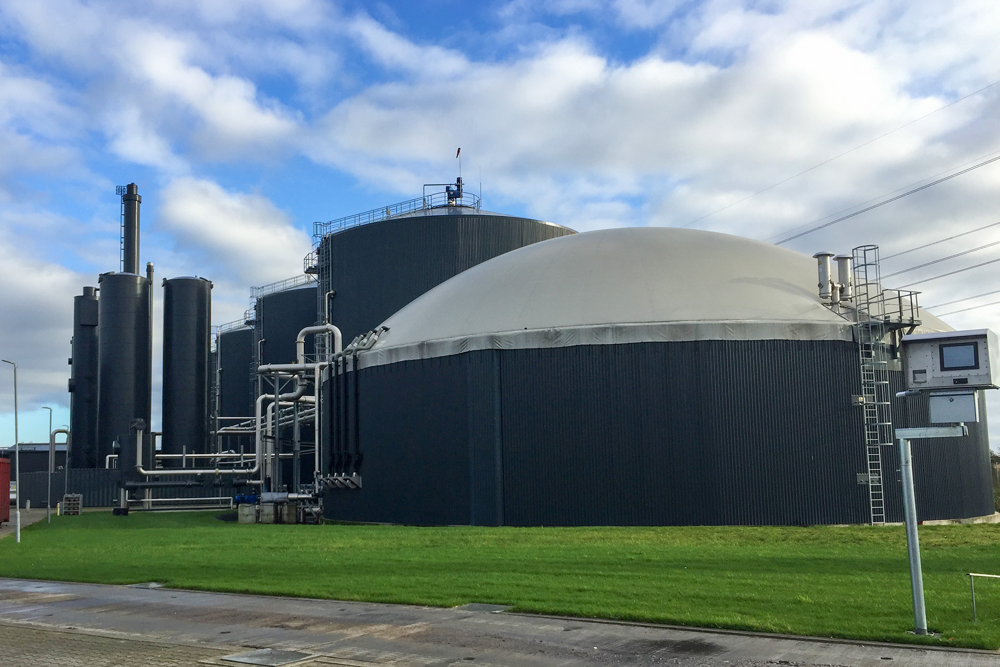

  

# 🏗 Implementation Roadmap – Danish-Style Integrated Dairy & Biogas Project

A professional execution framework designed for phased delivery of an industrial dairy and optional biogas platform.

This roadmap is prepared for:

- investors
- EPC contractors
- engineering partners
- dairy technology firms
- project management teams

---

## 📌 Execution Philosophy

The project is structured for phased and risk-controlled implementation.

This reduces:

- capital pressure
- execution risk
- technology integration risk
- cash flow delays

The implementation model allows:

### Option A
dairy-first deployment

### Option B
integrated dairy + biogas deployment

---

## 🇩🇰 Technology & Execution Standard

The implementation roadmap is aligned with advanced Danish and Northern European industrial delivery standards.

This includes:

- phased commissioning
- process validation
- operational ramp-up
- engineering quality control
- technical handover

This increases confidence for both investors and technical partners.

---

## 📅 Total Estimated Timeline

### Medium Scale
12–16 months

### Large Scale
16–22 months

depending on:

- land readiness
- permits
- utility access
- equipment lead time
- EPC contractor selection

---

# 🚀 Phase 0 – Feasibility & Structuring
## Duration: 1–2 months

Main objectives:

- site assessment
- preliminary engineering
- investment structure
- financial validation
- technical partner discussions

Deliverables:

- feasibility study
- CAPEX confirmation
- vendor shortlist
- implementation budget
- SPV / legal structure

This is the investor decision phase.

---

# 🧱 Phase 1 – Land & Site Preparation
## Duration: 2–3 months

  

Includes:

- land grading
- soil stabilization
- access roads
- drainage system
- utility corridors
- water connection

Key outputs:

- fully prepared industrial site
- truck access routes
- utility backbone

---

# 🐄 Phase 2 – Dairy Infrastructure Construction
## Duration: 4–6 months

  

Main scope:

- steel-frame barns
- feeding corridors
- water systems
- veterinary zone
- service building
- storage areas

This phase creates the core dairy operation.

---

# 🥛 Phase 3 – Dairy Process Installation
## Duration: 2–3 months

Includes:

- milking systems
- milk cooling
- storage tanks
- hygiene systems
- pumping network
- control systems

Commissioning target:

### Start milk production

This is the first revenue milestone.

---

# 💩 Phase 4 – Manure Handling & Recovery
## Duration: 1–2 months

Scope:

- slurry channels
- pumps
- storage tanks
- transfer pipelines
- sealed holding systems

This phase is essential whether biogas is included or not.

---

# ⚡ Phase 5 – Biogas Construction (Optional / Recommended)
## Duration: 3–5 months

  

Includes:

- digester construction
- gas dome
- CHP units
- control room
- safety systems
- digestate recovery

This may run in parallel with dairy ramp-up.

---

# 🔬 Phase 6 – System Integration & Testing
## Duration: 1–2 months

  

Critical checks:

- flow testing
- pressure testing
- CHP validation
- milking automation
- power stability
- fertilizer separation

This phase is extremely important.

No commercial launch before this is completed.

---

# 📈 Phase 7 – Commercial Operations
## Duration: Go-Live

Commercial start points:

### Revenue stream 1
milk sales

### Revenue stream 2
electricity / heat

### Revenue stream 3
organic fertilizer

This is the full operational phase.

---

# 🧭 Recommended Investment Path

## Stage 1
Standalone dairy

### 6–9 months to first revenue

---

## Stage 2
Biogas integration

### +4–6 months
This staged approach significantly reduces investor risk.

---

# 👷 Workforce Ramp-Up

## Medium Scale
40–65 staff

---

## Large Scale
80–120 staff

Including:

- operations
- maintenance
- veterinary
- process control
- utility
- management

---

# 📦 Procurement Strategy

Recommended procurement model:

### EPC + owner supervision

This ensures:

- contractor accountability
- cost control
- delivery schedule discipline

Potential equipment sourcing:

- Danish / EU technology
- regional EPC support
- local civil execution

---

# ⚠️ Execution Risk Controls

Key control points:

- milestone-based payment
- technical acceptance gates
- commissioning hold points
- investor reporting
- contingency budget

---

# 💰 Capital Deployment Timeline

## Phase 0–2
35% CAPEX

## Phase 3–4
25% CAPEX

## Phase 5–6
30% CAPEX

## Working capital
10%

This phased capital structure is investor-friendly.

---

# 🎯 Implementation Conclusion

The project is designed for professional phased execution with strong technical governance and scalable deployment.

The roadmap supports:

- faster first revenue
- phased capital commitment
- optional biogas integration
- reduced execution risk
