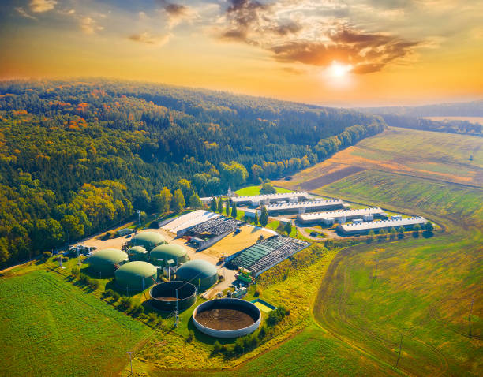
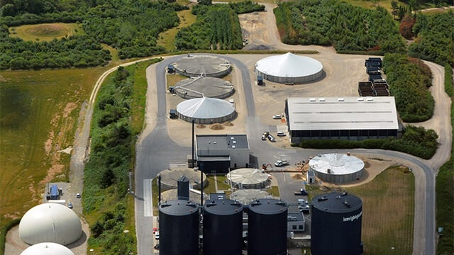
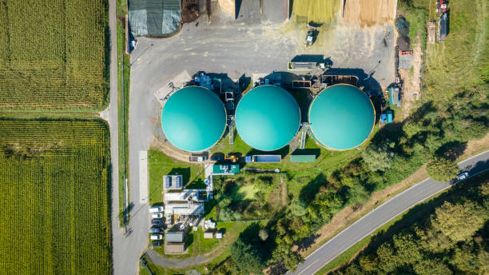
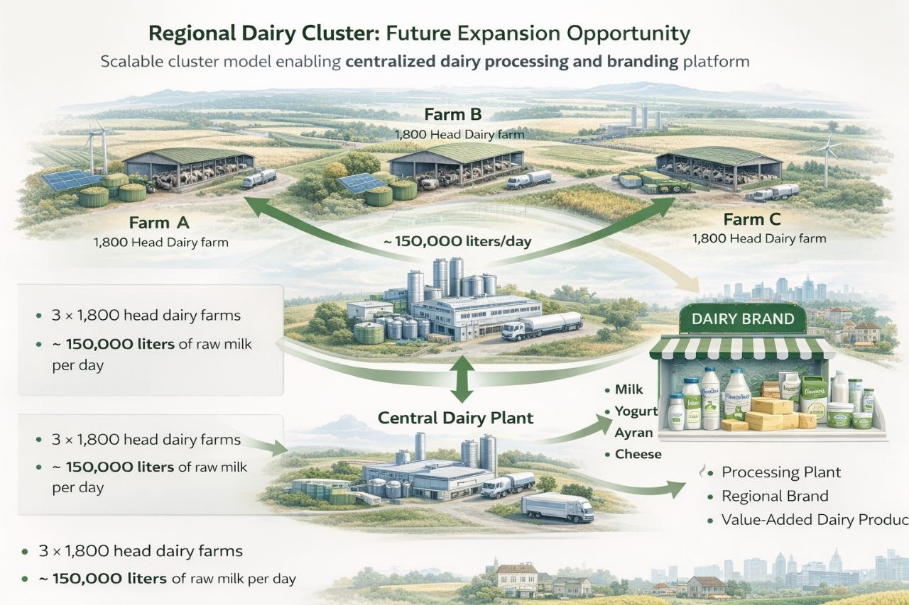

  

# 🐄 Danish-Style Integrated Dairy & Biogas Project
## Investor Pitch Deck

---

# Slide 1 — Vision

## Transforming Dairy Farming into an Integrated Agro-Energy Platform

A scalable industrial dairy and biogas project inspired by advanced Danish technology and circular economy principles.

Core pillars:

- industrial milk production
- renewable energy
- organic fertilizer
- ESG-driven growth
- scalable expansion

---

# Slide 2 — The Opportunity

  

Global demand drivers:

- stable dairy demand
- renewable energy transition
- fertilizer market growth
- ESG investment trend

The project combines multiple high-demand sectors in one integrated platform.

---

# Slide 3 — Why This Model Works

## Three Revenue Streams

### 🥛 Dairy
stable recurring cash flow

### ⚡ Energy
biogas → electricity / heat / gas

### 🌱 Fertilizer
digestate commercialization

This reduces risk compared with single-stream farming models.

---

# Slide 4 — Technical Infrastructure

  

Integrated infrastructure:

- industrial barns
- milking systems
- feed and silage
- slurry handling
- biogas digesters
- CHP units
- fertilizer processing

Built according to Danish and European standards.

---

# Slide 5 — Project Scenarios

## 🟢 Medium Scale
1,800 head

- 16–20M liters milk/year
- 400–700 kW electricity
- 2–3 MW thermal
- CAPEX: $28–32M

---

## 🔵 Large Scale
3,800 head

- 35–42M liters milk/year
- 1–1.5 MW electricity
- 4–7 MW thermal
- CAPEX: $55–62M

---

# Slide 6 — Revenue Model

  

### Medium
$10.4M – $15.8M annually

### Large
$21.7M – $32.5M annually

Diversified revenue = stronger resilience

---

# Slide 7 — ROI & Returns

## Medium Scale

- IRR: 16–22%
- Payback: 5–8 years

---

## Large Scale

- IRR: 18–25%
- Payback: 4–7 years

Strong long-term recurring cash flow.

---

# Slide 8 — ESG & Sustainability

  

Environmental benefits:

- methane reduction
- renewable energy
- nutrient recycling
- lower emissions
- sustainable agriculture

This significantly improves ESG investment attractiveness.

---

# Slide 9 — Strategic Advantage

## 🇩🇰 Denmark-Based Technology Access

The project is aligned with advanced Danish and Northern European industrial models.

Strategic access to:

- dairy engineering
- biogas systems
- operational standards
- technical partnerships

This creates strong credibility for execution.

---

# Slide 10 — Investment Structure

Flexible investment options:

### Phase 1
dairy-only

### Phase 2
biogas integration

### Phase 3
processing & expansion

This allows staged capital deployment.

---

# Slide 11 — Why Invest Now

- stable food sector
- growing energy demand
- ESG capital trend
- multiple revenue streams
- scalable industrial model

---

# Slide 12 — Closing

## Building the Future of Dairy, Energy, and Sustainable Agriculture

A scalable agro-industrial platform with strong financial and environmental value.

---

# 🧀 Future Expansion – Regional Dairy Cluster

  

The project is designed as a scalable regional dairy cluster platform.

A future expansion scenario includes:

- 3 × 1,800 head dairy farms
- centralized milk processing
- integrated biogas systems
- regional dairy brand creation

Estimated processing volume:

## ~150,000 liters/day

This production scale supports the commercial viability of a central dairy processing facility for:

- milk
- yogurt
- drinkable yogurt (ayran / doogh)
- cheese
- butter
- cream products

This cluster model significantly improves:

- transportation efficiency
- processing margins
- branding value
- investor return
- regional market penetration

At larger scales, the model supports 6–10 dairy units within one industrial agricultural zone.

This enables the creation of a fully independent regional dairy brand and industrial processing ecosystem.

Prepared for:
- strategic investors
- family offices
- infrastructure funds
- industrial partners
