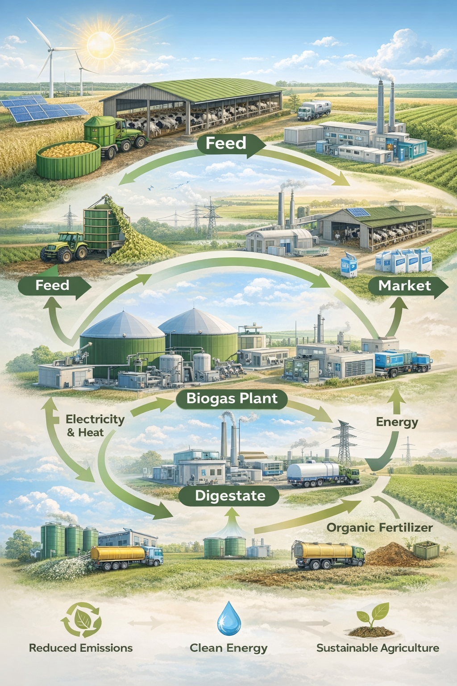
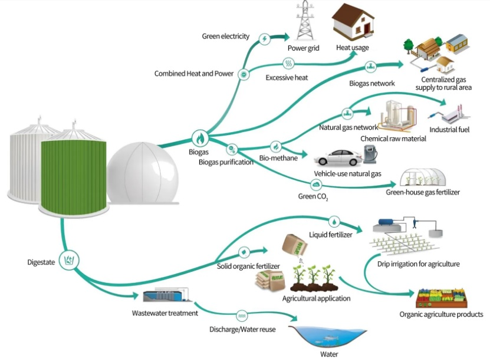
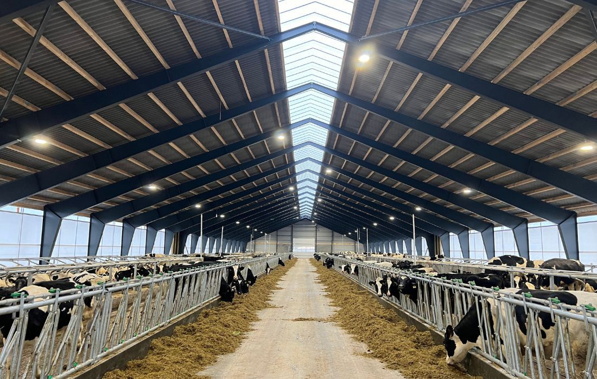
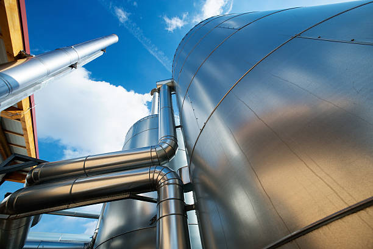

  

# 🐄 Danish-Style Integrated Dairy & Biogas Project

🚀 A large-scale industrial dairy and renewable energy platform based on the Danish model, integrating milk production, biogas energy generation, and organic fertilizer systems into a closed-loop agro-energy ecosystem adaptable to diverse geographical, climatic, and economic conditions.

---

## 📌 Executive Summary

This project proposes the development of a fully integrated industrial dairy and biogas platform designed to operate at medium and large scales under a single agro-industrial framework.

The system combines:

- Industrial-scale milk production  
- Renewable energy generation from cattle manure and organic waste  
- High-value organic fertilizer production  
- Circular resource use with reduced environmental impact  

The project is based on proven Danish and European operational models and is designed to be adaptable across multiple regions, making it suitable for implementation under a wide range of local agricultural conditions.

---

## 🧩 Project Concept

This is not a conventional dairy farm.

It is a multi-output industrial platform where livestock production, renewable energy, and agricultural nutrient recovery are fully integrated into one operational system.

The concept transforms dairy operations into a circular economy model in which:

- Milk becomes the primary food product  
- Manure becomes the primary energy feedstock  
- Biogas becomes electricity, heat, or upgraded gas  
- Digestate becomes a valuable organic fertilizer  

---

## 🌍 Integrated Circular System

  

The project is designed as a closed-loop system linking:

- Feed and livestock production  
- Milk output and market access  
- Biogas production from manure  
- Electricity and heat generation  
- Organic fertilizer recovery  
- Water reuse and agricultural application  

This structure significantly improves resource efficiency and reduces waste.

---

## ⚙️ Core System Components

### 🐄 Industrial Dairy Farm

- High-capacity cattle housing with ventilated and climate-adaptive barns  
- Automated or semi-automated feeding systems  
- Robotic or rotary milking systems  
- Integrated manure collection, transfer, and storage systems  

### ⚡ Biogas Production System

- Industrial anaerobic digestion units  
- Continuous biogas production from livestock manure  
- CHP (Combined Heat and Power) system for electricity and heat  
- Optional upgrading to biomethane depending on project scale and market conditions  

### 🌱 Organic Fertilizer System

- Digestate stabilization and processing  
- Liquid and solid fertilizer separation  
- Agricultural reuse as organic fertilizer  
- Potential commercial fertilizer sales  

---

## 📊 Project Scale Scenarios

### 🟢 Medium Industrial Scale

- 1,800 cattle  
- ~54,000 liters of milk per day  
- ~36,000 tons of manure per year  
- 400–600 kW continuous electricity generation  
- 2–4 MW thermal output  

### 🔵 Large Industrial Scale

- 3,800 cattle  
- ~110,000 liters of milk per day  
- ~75,000 tons of manure per year  
- 1–1.5 MW electricity generation  
- 5–8 MW thermal output  

These two scenarios provide a realistic basis for phased investment and scalable industrial implementation.

---

## 🏭 Industrial Infrastructure

  

The biogas facility is designed as an industrial energy asset, not as a small farm-side add-on.

Key infrastructure elements include:

- Digesters  
- Gas storage system  
- CHP units  
- Pumping and transfer systems  
- Process control systems  
- Fertilizer output handling  
- Utility integration with dairy operations  

---

## 🌄 Site Layout & Integrated Scale

  

The integrated site layout demonstrates the project as a unified agro-energy platform rather than isolated components.

The full layout is intended to support:

- Dairy production operations  
- Biogas generation  
- Fertilizer handling  
- Vehicle and feed logistics  
- Utility routing  
- Future industrial expansion  

---

## 🐄 Dairy Operation

  

The dairy unit is structured for high-efficiency industrial livestock management.

Core operational features include:

- Controlled feeding  
- Hygienic cattle housing  
- Reduced labor intensity through mechanization  
- Improved milk productivity per head  
- Better manure capture efficiency for biogas feedstock  

---

## 🔋 Engineering Detail

  

This project is intended to be executed at a professional engineering standard.

Key engineering priorities include:

- Material durability  
- Process reliability  
- Continuous operation  
- Industrial-grade piping and equipment integration  
- Safety and monitoring systems  

---

## 💰 Capital Expenditure (CAPEX)

### Medium Scale (1,800 Head)

- Dairy infrastructure: ~$18M  
- Biogas plant: ~$8M  
- Utilities and infrastructure: ~$4M  

Total estimated investment: ~$30M

### Large Scale (3,800 Head)

- Dairy infrastructure: ~$35M  
- Biogas plant: ~$18M  
- Utilities and infrastructure: ~$7M  

Total estimated investment: ~$60M

These figures are feasibility-level industrial estimates and can be refined in detailed engineering and procurement phases.

---

## 💵 Revenue Model

The project is structured around diversified revenue streams:

### 🥛 Dairy Production
Primary income stream through industrial-scale milk production.

### ⚡ Energy Production
Electricity and thermal energy generated from biogas for internal use or external sale.

### 🌱 Organic Fertilizer
Digestate processed into marketable liquid and solid fertilizer products for agricultural reuse or sale.

This diversified model strengthens resilience and improves long-term project economics.

---

## 📈 Estimated Annual Revenue

- Medium scale: $18M – $22M  
- Large scale: $35M – $45M  

The exact revenue mix will depend on:
- Milk pricing  
- Energy sale structure  
- Fertilizer monetization  
- Local market conditions  

---

## 🌱 Environmental Value

The project is designed to deliver strong environmental benefits:

- Reduced uncontrolled manure emissions  
- Lower methane release into the atmosphere  
- Renewable energy generation  
- Improved nutrient recycling  
- Reduced dependence on chemical fertilizers  
- Better waste and water management  

This makes the project highly relevant for ESG-focused investors and sustainability-driven industrial partnerships.

---

## 🌍 Deployment Flexibility

This project is not tied to a single geographic location.

It is designed to be adaptable across a wide range of regions, provided that the following are available:

- Sufficient land area  
- Livestock production base  
- Water and utility access  
- Agricultural demand for fertilizer  
- Regulatory feasibility  

This flexibility makes the project suitable for multiple geographic, climatic, and economic contexts.

---

## 🤝 Implementation & Partnership Potential

The project is structured to enable collaboration with:

- Dairy engineering firms  
- Biogas technology providers  
- Agricultural system integrators  
- Industrial EPC contractors  
- Energy partners  
- International or regional investors  

Potential execution relevance includes Danish and European ecosystems associated with:
- industrial dairy systems  
- anaerobic digestion and biogas engineering  
- agricultural nutrient recycling  
- farm energy optimization  

---

## 👤 Project Leadership

Arvin Arpanahi

- Experience in industrial and agricultural project coordination  
- Strong focus on execution quality and integrated system development  
- Strategic interest in building scalable agro-industrial platforms

The project leadership model is based on coordinating specialist teams while maintaining centralized project direction, execution discipline, and long-term development vision.

---

## 🚀 Vision

To build a next-generation dairy and biogas platform that integrates:

- food production  
- renewable energy  
- sustainable agriculture  
- industrial nutrient recovery  

The long-term objective is to transform livestock farming into a multi-output industrial ecosystem capable of generating economic value, environmental benefit, and scalable regional impact.

---

## 📊 Investor Access

Detailed technical, financial, implementation, risk, supply chain, and partnership documentation is available upon request for qualified investors, technical partners, and project execution stakeholders.
