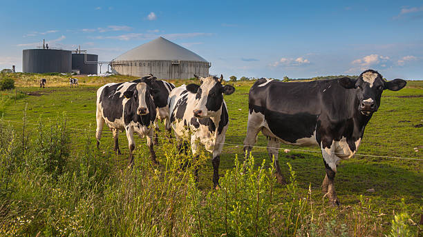

[3/28/2026 10:55 AM] Arvin Arpanahi: 

  

# ⚙️ Technical Framework – Danish-Style Integrated Dairy & Biogas Project

A professional technical framework for the development of a scalable industrial dairy farm integrated with optional biogas and renewable energy infrastructure.

This document is designed for:
- investors
- EPC contractors
- dairy engineering firms
- biogas technology partners
- strategic industrial collaborators

---

## 🇩🇰 Danish Technology Reference & Strategic Access

The technical concept is inspired by advanced Danish and Northern European industrial dairy and biogas systems.

Denmark is among the global leaders in:

- industrial dairy automation
- livestock productivity systems
- manure handling and nutrient recovery
- commercial-scale anaerobic digestion
- CHP and biomethane integration

Being based in Denmark creates a strategic advantage for access to:

- advanced dairy engineering know-how
- biogas technology providers
- European process standards
- potential collaboration with Danish industrial firms

This provides strong alignment with globally proven technology models.

---

## 🐄 Project Technical Structure

The project is designed as a dual-platform system:

### Platform A — Industrial Dairy Farm
A standalone advanced dairy operation

### Platform B — Integrated Biogas Facility
Optional but highly recommended renewable energy and fertilizer recovery module

This means the investor may proceed with:

- dairy-only investment
- dairy + biogas integrated investment

depending on capital strategy and long-term ROI goals.

---

## 🐄 Dairy Farm Engineering Design

  

The dairy system is designed according to modern European livestock engineering principles.

### Capacity Scenarios

### 🟢 Medium Scale
- 1,800 head cattle
- 1,200 lactating cows
- 600 replacement / support livestock

### 🔵 Large Scale
- 3,800 head cattle
- 2,600 lactating cows
- 1,200 support livestock

---

## 🏗 Barn Engineering

The facility includes:

- climate-controlled steel-frame barns
- natural + mechanical ventilation
- automated feeding corridors
- water distribution system
- manure channel systems
- service and veterinary zones

### Space Standards

### Medium
Approx. 25,000–30,000 m² built area

### Large
Approx. 55,000–65,000 m² built area

---

## 🥛 Milk Production System

Modern production options include:

- robotic milking
- rotary parlor
- parallel milking lines

### Estimated Production

### Medium
45,000–55,000 liters/day

### Large
95,000–120,000 liters/day

Annualized production:

### Medium
16–20 million liters/year

### Large
35–42 million liters/year

---

## 🌾 Feed & Silage Infrastructure

The project includes dedicated feed handling:

- silage bunkers
- grain storage
- automated feed mixing
- conveyor / tractor distribution routes

Feed components may include:

- corn silage
- alfalfa
- barley
- soybean meal
- local forage alternatives

This allows adaptation to multiple geographies including Iran.

---

## 💩 Manure Collection System

The project is engineered for full manure recovery.

  

Includes:

- scraping channels
- liquid collection tanks
- slurry transfer pumps
- sealed manure holding basin

### Estimated Manure Output

### Medium
55–70 tons/day

### Large
120–150 tons/day

This becomes the primary feedstock for the biogas system.

---

## ⚡ Biogas Plant (Optional Integrated Module)

  

This module converts manure and organic waste into:

- electricity
- heat
- biomethane
- fertilizer

---

## 🔬 Digestion Technology

Core process:

### Anaerobic Digestion

Process stages:

1. feedstock intake
2. slurry homogenization
3. digestion tank
4. gas separation
5. CHP / upgrading
6. digestate recovery

Typical retention:

25–35 days

Temperature:
[3/28/2026 10:55 AM] Arvin Arpanahi: - mesophilic 35–38°C
- thermophilic optional

---

## ⚡ Energy Output

  

### Medium Scale
400–700 kW continuous electricity

### Large Scale
1–1.5 MW electricity

Heat output:

### Medium
2–3 MW thermal

### Large
4–7 MW thermal

Energy may be used for:

- dairy operation
- cooling systems
- barn heating
- local grid sale
- biomethane upgrading

---

## 🌱 Fertilizer Recovery

  

Digestate is processed into:

- liquid fertilizer
- solid organic fertilizer

Potential uses:

- crop fields
- feed production land
- commercial fertilizer sales

This significantly improves project economics.

---

## 💧 Water & Utility Systems

Includes:

- drinking water network
- wash-down systems
- wastewater recovery
- process water reuse
- utility pumping station

Estimated water demand:

### Medium
120–180 m³/day

### Large
250–350 m³/day

---

## 🚛 Logistics & Access

Required infrastructure:

- feed truck routes
- milk tanker access
- manure logistics
- maintenance routes

Internal road network:

### Medium
3–5 km

### Large
6–10 km

---

## 🏭 Industrial Expansion Potential

The project is designed for expansion into:

- milk powder plant
- cheese / yogurt production
- fertilizer packaging
- biomethane filling station
- greenhouse agriculture

This increases long-term industrial value.

---

## 📈 Technical Investment Estimate

### Medium Scale
$28M – $35M

### Large Scale
$55M – $70M

Includes:

- dairy infrastructure
- mechanical systems
- biogas facility
- utilities
- roads and access

---

## 🎯 Investor Decision Flexibility

The technical structure supports two investment paths:

### Option A
Standalone dairy project

### Option B
Integrated dairy + biogas project

This flexibility is extremely important for phased investment.

---

## 🚀 Technical Conclusion

This project is designed as a scalable, high-efficiency industrial dairy and renewable energy platform based on globally proven Danish technology principles and adaptable to regional implementation conditions.
